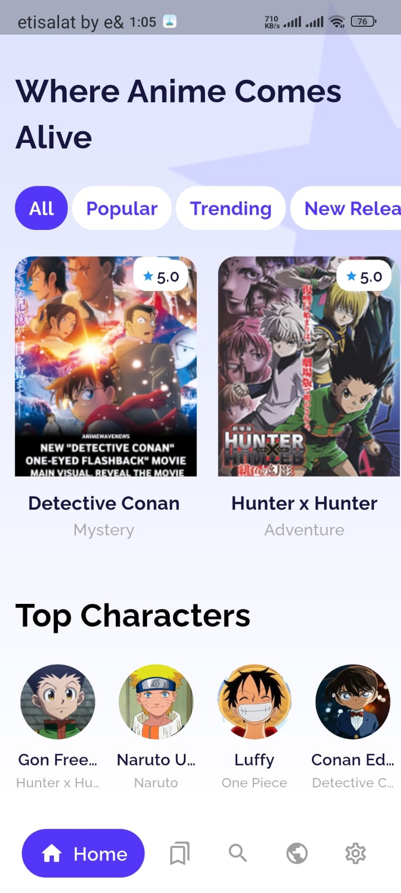
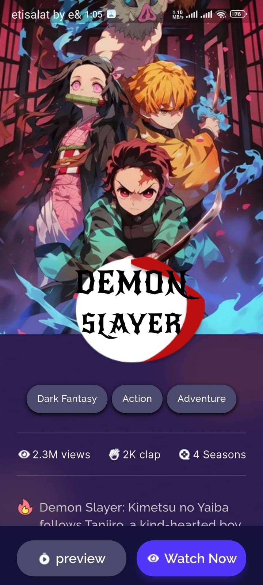
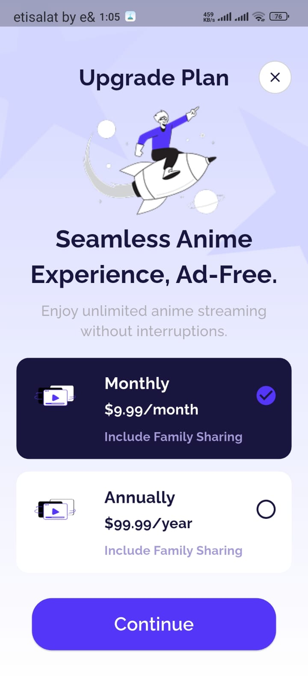

# Badr-Elarby-Week-2-Mini-UI-only-App-Clean-Architecture
[](https://deepwiki.com/Badr-Elarby/Badr-Elarby-Week-2-Mini-UI-only-App-Clean-Architecture)

This repository contains a Flutter application that implements the UI for an anime streaming service. The project showcases a modern user interface and is structured using the principles of Clean Architecture.

## Features

- **Home Screen**: A dynamic home screen with a welcoming header, a filterable tab bar for categories like "Popular" and "Trending", a horizontally scrolling list of featured anime, and a section for top characters.
- **Details Screen**: An immersive details page for each anime, featuring a large background image, a custom title badge, genre tags, statistics (views, claps), a comprehensive description, and action buttons.
- **Subscription Screen**: A visually appealing screen for users to upgrade their plan, offering monthly and annual subscription options.
- **Responsive Design**: The UI is designed to be responsive across different screen sizes using the `flutter_screenutil` package.
- **Custom Theming**: The app utilizes custom colors and font styles, including 'Raleway' and 'New Rocker' from `google_fonts`, to create a unique visual identity.

## Screens

### Home Screen
The main landing page of the application. It provides an overview of available content, organized into sections for easy navigation. Users can filter anime by category and view popular characters.

### Details Screen
This screen provides an in-depth look at a selected anime. It uses a blurred background effect and creative layering to present information such as genre, plot summary, and viewer engagement statistics.

### Subscription Screen
This screen encourages users to upgrade to a premium plan. It clearly presents the benefits and options for monthly or annual subscriptions in a clean and engaging layout.

## Architecture

This project is structured following the **Clean Architecture** principles to ensure a decoupled, scalable, and maintainable codebase. The core logic is separated into distinct layers for each feature.

The directory structure for each feature is organized as follows:

-   **/lib**
    -   **/features**
        -   **[feature_name]** (e.g., `home`, `details`, `subscription`)
            -   **/data**: Contains data source implementations and repository implementations. (Currently contains placeholders).
            -   **/domain**: Includes entities, use cases, and repository interfaces. (Currently contains placeholders).
            -   **/presentation**: Contains the UI (screens, widgets) and state management (cubits) for the feature.

This separation of concerns makes the application easier to test, modify, and scale over time.

## Getting Started

To get a local copy up and running, follow these simple steps.

### Prerequisites

-   Flutter SDK: [Installation Guide](https://flutter.dev/docs/get-started/install)

### Installation

1.  Clone the repository:
    ```sh
    git clone https://github.com/badr-elarby/badr-elarby-week-2-mini-ui-only-app-clean-architecture.git
    ```
2.  Navigate to the project directory:
    ```sh
    cd badr-elarby-week-2-mini-ui-only-app-clean-architecture
    ```
3.  Install the dependencies:
    ```sh
    flutter pub get
    ```
4.  Run the application:
    ```sh
    flutter run
    ```
## 📸 Screenshots

| Home Screen | Details Screen | Subscription Screen |
|-------------|----------------|---------------------|
|  |  |  |


## 📸 video demo
 
